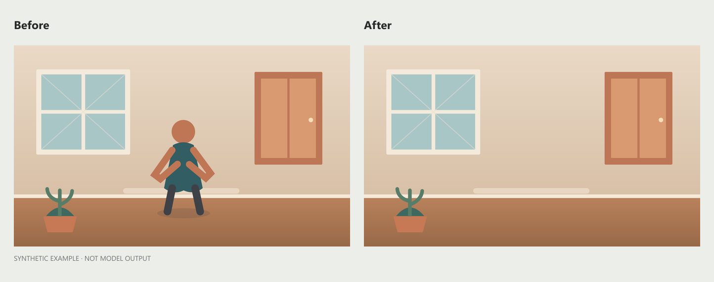
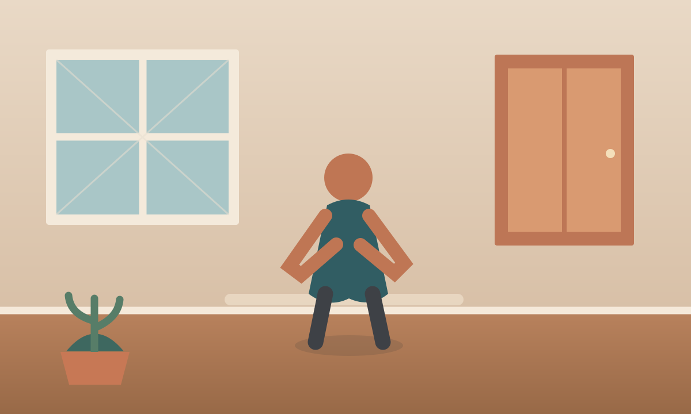
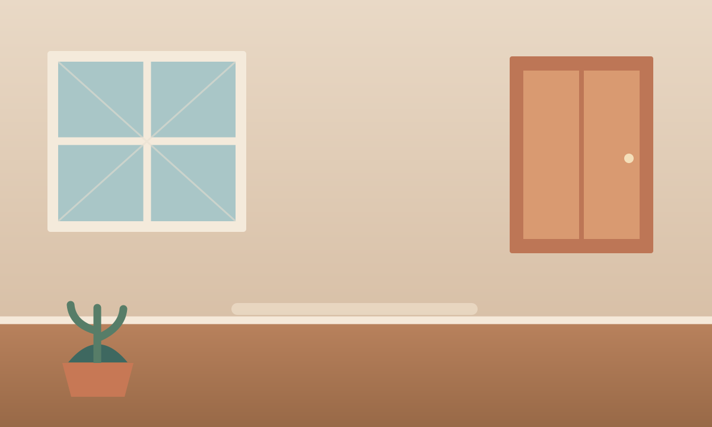

# TypeScript Images

A command-line image editing tool powered by OpenRouter. It accepts one image and a removal description, saves generated images in the selected format (PNG by default), and can open a desktop before-and-after preview.

## Preview

The comparison layout below is built from synthetic artwork to demonstrate the viewer. It is not output from the image-generation model.



| Synthetic input | Synthetic edited result |
| --- | --- |
|  |  |

## Requirements

- Node.js
- An OpenRouter API key with access to the configured image-generation model

## Setup

Install dependencies:

```sh
npm install
```

Set your API key in the environment before running the application.

PowerShell:

```powershell
$env:OPENROUTER_API_KEY = "your-api-key"
```

Bash or Zsh:

```sh
export OPENROUTER_API_KEY="your-api-key"
```

## Usage

Print the application usage page:

```sh
npm run help
```

```sh
npm start -- <image-file> "<what-to-remove>" [quality] [--output-format <png|jpeg|webp|svg>] [--aspect-ratio <ratio>] [--resolution <tier>] [--nooutput]
```

Supported input formats are JPG/JPEG, PNG, and WebP. Both the file extension and image contents are checked.

The required removal description is inserted into the editing prompt as the subject to remove. Include an article where appropriate, such as `the person` or `the red car`, and quote descriptions containing spaces. The optional quality value can be `auto`, `low`, `medium`, `high`, `xhigh`, or `max`; it defaults to `high`.

Optional `--aspect-ratio` values are `1:1`, `1:2`, `1:4`, `1:8`, `2:1`, `2:3`, `2.35:1`, `3:2`, `3:4`, `4:1`, `4:3`, `4:5`, `5:2`, `5:4`, `5:7`, `7:5`, `8:1`, `9:16`, `16:9`, `9:19.5`, `19.5:9`, `9:20`, `20:9`, `9:21`, `21:9`, and `auto`. Optional `--resolution` values are `512`, `768`, `1K`, `2K`, and `4K`. If omitted, either property is excluded from the API request. When resolution is set, it replaces the explicit source-pixel `size` field.

Use `--output-format` to select the generated image format: `png`, `jpeg`, `webp`, or `svg` (the formats declared by the OpenRouter SDK). It defaults to `png`. Saved files use the selected extension.

Examples:

```sh
npm start -- ./images/photo.jpg "the person"
npm start -- ./images/photo.png "the red car" xhigh
npm start -- ./images/photo.png "the red car" --output-format webp
npm start -- ./images/photo.png "the red car" --aspect-ratio 16:9 --resolution 2K
npm start -- ./images/photo.png "the red car" --output-format svg --nooutput
npm start -- ./images/photo.png "the red car" --nooutput
```

Generated images are saved beside the input as `<filename>_edited_1.png`, `<filename>_edited_2.png`, and so on. The application opens a desktop comparison preview with the original on the left and generated images on the right.

Pass `--nooutput` to skip opening the desktop comparison viewer. When `--resolution` is omitted, the source image dimensions are sent as the requested output size; when a resolution tier is provided, that tier is sent instead and explicit size is omitted. The selected model or provider may return a different supported size. Console output reports workflow steps and save progress, then prints generated image paths as a comma-separated final line (empty if no images were returned).

Example terminal output (illustrative):

```text
Image edit workflow
	Input: ./images/photo.png

1/4  Loading and validating image
	Done  PNG image ready (1200 x 800, ratio 1.500, 248,012 bytes)

2/4  Generating edited image
✔ Image generation complete

3/4  Saving 2 generated image(s)
	Done  Saved 2 image(s)

4/4  Viewer skipped (--nooutput)
./images/photo_edited_1.png,./images/photo_edited_2.png
```

The preview artwork is reproducible with `node scripts/generate-readme-examples.mjs`.

## Development

```sh
npm run build
npm test
```